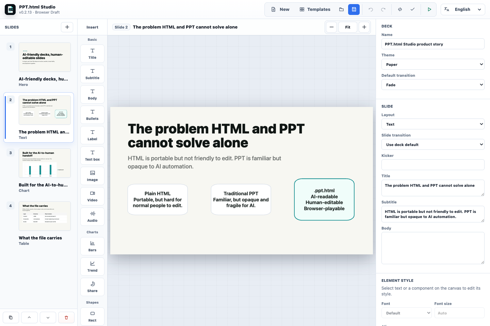

# PPT.html Studio / htmlppt

PPT.html Studio is an AI-friendly, human-editable presentation editor. It turns structured deck data into a single `.ppt.html` file that can be opened in a browser, edited again in the app, and shared like an ordinary HTML file.



## Core Positioning

PPT.html Studio is built for the missing middle between plain HTML and traditional PPT.

主打解决的问题：AI 可以稳定生成和修改结构化内容，人类可以继续像 Keynote / PowerPoint 一样直观编辑，最后交付的仍然是一个能播放、能分享、能再次打开编辑、并且能包含图片/视频/音频/图表等资源的单文件 `.ppt.html`。

| Need | Plain HTML | Traditional PPT | PPT.html Studio |
| --- | --- | --- | --- |
| Easy to share | Good | Needs app/export | One browser-openable `.ppt.html` file |
| Human visual editing | Hard for non-developers | Familiar | Canvas editing, direct text edits, drag/resize, style panel |
| AI generation and repair | Too free-form | Opaque file internals | Structured JSON schema plus validation reports |
| One-file delivery with assets | Possible but manual | Usually bundled in PPTX | Embeds deck data, renderer, images, video, audio, and charts |
| Deterministic design | Requires hand-written CSS | Easy to drift slide by slide | Templates, themes, and structured layout constraints |

In short: this is not “HTML pretending to be PPT” and not “another PPT clone.” It is a structured presentation container where AI edits the data, humans edit the visual result, and the renderer keeps the output portable and predictable.

## New in v0.2.15

PPT.html Studio now tightens the presentation and editor basics that matter for everyday PPT use: presentation mode can switch between full-slide Fit and edge-to-edge Fill, the same shortcut is available in exported single-file players with `M`, a built-in shortcut dialog is available from the player and desktop Help menu, portrait touch presentation avoids accidental page turns when showing controls, `Shift+F5` now respects the currently presented slide, the object-panel Delete button follows the same multi-selection deletion path as the keyboard, and the release workflow runs on Node.js 24.

## New in v0.2.14

PPT.html Studio now has a stronger AI/human editing loop: inserted canvas objects receive object-level validation for duplicate ids, geometry, media, chart, table, card, metric, timeline, quote, code, and compare data; selected image/video/audio, chart, and table objects expose typed inspectors so users can edit common fields without touching JSON; the Quality Check dialog can copy a complete AI repair prompt containing the current deck and validation report; and the bundled `htmlppt` skill plus deck CLI are documented as the official handoff path for other agents.

## New in v0.2.13

PPT.html Studio now keeps the left slide thumbnails stable while changing pages. Selecting another slide updates the active state and canvas without rebuilding the entire thumbnail strip, so fonts, controls, and preview positions no longer jump. The release also fixes Windows CI line-ending handling in the smoke tests.

## New in v0.2.10

PPT.html Studio now has a clearer first-run experience: a new recognizable HTML slide icon, real favicons in the editor and exported standalone `.ppt.html` files, a wider default desktop window, less cramped 1280px layout columns, a cleaner current-slide action bar, and earlier Electron app identity setup to reduce default Electron branding during launch.

## New in v0.2.9

PPT.html Studio now has a first object style inspector. Click text, text boxes, cards, table cells, metrics, chart legends, or media blocks on the canvas, then adjust font size, text color, alignment, bold, italic, background, border, radius, and opacity in the right panel. These edits are saved as structured `styles[path]` data, preserved in exported `.ppt.html` files, and remain readable for AI agents.

## New in v0.2.8

PPT.html Studio now inserts real canvas text boxes instead of silently switching the slide to a text layout. Text boxes appear in an open area by default, can be edited immediately, dragged, resized, nudged with arrow keys, deleted with Delete/Backspace, and exported through the structured `textBoxes` format. Live editing is smoother because side-panel typing is frame-batched and draft persistence is debounced.

## New in v0.2.7

PPT.html Studio now treats `.ppt.html` as a true single-file container. Before saving or downloading, external image, video, video poster, and audio sources are embedded as Data URI assets inside the same HTML file. Audio is also available as a first-class insertable slide component.

## New in v0.2.6

PPT.html Studio now exposes a real component palette in the main editor. Users can click or drag text, image, video, chart, table, card, metric, timeline, quote, and code components into the current slide. Common toolbar commands are icon-first with hover tooltips, videos are supported as first-class slide content, and the app UI can switch between Chinese, English, Japanese, and Korean.

## New in v0.2.5

PPT.html Studio now has a cleaner, more modern desktop UI inspired by OpenHuman-style local-first app surfaces: a dark compact top bar, lighter panels, refined slide thumbnails, polished form controls, a calmer canvas grid, softer shadows, and better responsive behavior on narrow screens.

## New in v0.2.4

PPT.html Studio now borrows the best direct-manipulation ideas from open-source visual editors while keeping the file AI-friendly. Click any editable slide element to show a canvas selection frame, drag it for precise placement, resize it with eight handles, nudge it with arrow keys, use `Shift` for faster nudges, and reset element geometry without touching the slide content. These edits are saved as structured `canvas` `x/y/w/h` data and survive standalone `.ppt.html` export.

## New in v0.2.3

PPT.html Studio now has a first canvas-style editing layer. Double-click rendered text, cards, metrics, table cells, chart legends, and code blocks to edit them in place; drag editable slide elements for light visual adjustments that are saved as structured `canvas` offsets; drag images onto the stage; and drag slide thumbnails to reorder pages.

## New in v0.2.2

PPT.html Studio now uses true full-window presentation scaling. The editor and exported `.ppt.html` player no longer reserve hidden margins for controls or cap presentation zoom, so 16:9 displays fill cleanly without the old black border.

## New in v0.2.1

PPT.html Studio now includes structured chart slides. Create bar, line, and donut charts from labels and series in the editor, or let AI generate the same `chart` JSON for a shareable `.ppt.html` file.

v0.2 also added the complete creation workflow: start from a template, edit the deck visually, paste AI-generated JSON directly from a code block, run a validation report, then save a single `.ppt.html` file from the desktop app.

The key idea stays the same: AI writes clean structure, humans make judgment calls, and the renderer keeps layout deterministic.

## Languages

- [中文首页](docs/home.zh-CN.md)
- [English Home](docs/home.en-US.md)
- [日本語ホーム](docs/home.ja-JP.md)
- [한국어 홈](docs/home.ko-KR.md)

## Detailed Tutorials

The tutorial pages are written as clear, chaptered guides in four languages.

Human-friendly manuals cover installation, templates, visual editing, AI JSON import, validation, presentation, saving, sharing, and troubleshooting:

- [中文教程](docs/tutorial-human.zh-CN.md)
- [English Tutorial](docs/tutorial-human.en-US.md)
- [日本語チュートリアル](docs/tutorial-human.ja-JP.md)
- [한국어 튜토리얼](docs/tutorial-human.ko-KR.md)

AI and agent authoring guides cover the JSON contract, deck structure, layout selection, field formats, validation-report repair flow, complete examples, reusable prompts, and common mistakes:

- [中文 AI 指南](docs/tutorial-ai.zh-CN.md)
- [English AI Guide](docs/tutorial-ai.en-US.md)
- [日本語 AI ガイド](docs/tutorial-ai.ja-JP.md)
- [한국어 AI 가이드](docs/tutorial-ai.ko-KR.md)

Agent integration guides explain how other agents should use the project skill, deck CLI, validation reports, extraction, build commands, and multi-agent handoff workflow:

- [中文 Agent 接入方案](docs/agent-integration.zh-CN.md)
- [English Agent Integration](docs/agent-integration.en-US.md)
- [日本語 Agent 連携ガイド](docs/agent-integration.ja-JP.md)
- [한국어 Agent 연동 가이드](docs/agent-integration.ko-KR.md)

Product roadmap:

- [中文路线图](docs/roadmap.zh-CN.md)
- [HTML 画布编辑项目调研与实施计划](docs/canvas-editor-research.zh-CN.md)

Release operations:

- [macOS 签名与公证指南](docs/macos-notarization.zh-CN.md)
- [macOS Signing and Notarization Guide](docs/macos-notarization.en-US.md)
- [macOS 署名と公証ガイド](docs/macos-notarization.ja-JP.md)
- [macOS 서명 및 공증 가이드](docs/macos-notarization.ko-KR.md)

## Quick Start

Run the browser editor:

```bash
npm install
npm run serve
```

Open:

```text
http://localhost:5173
```

Run the desktop app:

```bash
npm start
```

## Five-Minute Tutorial

1. Open PPT.html Studio.
2. Click `Templates` and choose Product Pitch, Lesson, Project Update, or the demo deck.
3. Edit the title, subtitle, metrics, charts, table rows, or slide order in the visual editor. You can also double-click text directly on the canvas, drag editable elements, resize them with handles, and nudge the selected element with arrow keys.
4. Click `AI JSON` to paste a deck from an AI model. Fenced `json` code blocks are accepted.
5. Click `Check` and copy the validation report back to AI if anything needs repair.
6. Click `Present` to preview the deck.
7. Use `Save / Download`, or desktop `Save As`, to create one shareable `.ppt.html` file. Images, video, audio, posters, CSS, and player JavaScript are packaged into that one file.

Build the desktop app locally:

```bash
npm run dist
```

## Agent And Skill Workflow

Install the bundled Codex skill:

```bash
npm run skill:install -- --force
```

Use the deck CLI from any agent or script:

```bash
npm run deck:validate -- path/to/deck.json
npm run deck:validate -- path/to/deck.ppt.html --json
npm run deck:extract -- path/to/deck.ppt.html path/to/deck.json
npm run deck:build -- path/to/deck.json path/to/deck.ppt.html
```

Repository-level agent guidance lives in [AGENTS.md](AGENTS.md), and the reusable skill lives in [skills/htmlppt](skills/htmlppt). The default automated gate for agent handoffs is:

```bash
npm run test:readonly
```

## What Is PPT.html?

A `.ppt.html` file is normal HTML with structured presentation data embedded inside:

```html
<script id="ppt-html-data" type="application/vnd.ppt-html+json">
{
  "version": "0.1",
  "title": "Demo",
  "theme": "launch",
  "slides": []
}
</script>
```

AI writes the JSON. The renderer turns it into slides. Humans can edit it in PPT.html Studio.

## Current Product Focus

- Start from built-in templates for product pitches, lessons, project updates, or the demo deck.
- Open, save, and save as `.ppt.html` files in the desktop app.
- Import local images into image slides as embedded data URIs.
- Double-click canvas text to edit in place, drag or resize editable slide elements for structured `canvas` geometry, style selected elements through structured `styles`, nudge selection with arrow keys, reset a selected element, and drag thumbnails to reorder pages.
- Create bar, line, and donut charts from structured labels and series.
- Edit selected image/video/audio, chart, and table canvas objects through typed inspectors without touching raw JSON for common fields.
- Copy an AI repair prompt that includes the current deck JSON, validation report, and repair rules.
- Use the bundled `htmlppt` Codex skill and deck CLI for agent handoff, validation, extraction, and standalone build workflows.
- Run `Check` to get a human-readable and AI-readable validation report.

## Release Builds

GitHub Actions builds release packages for:

- Linux x64
- macOS Apple Silicon arm64
- macOS Intel x64
- Windows x64

Release builds are triggered by tags such as:

```bash
git tag vX.Y.Z
git push origin vX.Y.Z
```

The release workflow validates that the tag matches `package.json` exactly. For notarized macOS assets, set the repository variable `ENABLE_APPLE_NOTARIZATION=true` and configure the Apple secrets documented in the macOS signing guide; otherwise macOS packages are still built as unsigned fallback artifacts.
